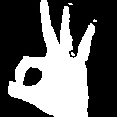

# Hand Gestures Recognition and Automation (Perceptron and CNN)

Goal is to recognize hand gestures. We've trained the model on our own dataset using *Perceptron* (and *CNN* thereafter). We've included our dataset in the repository itself. In it's present state the model is trained to recognize 7 gestures but can easily be trained for many hand gestures. We have also uploaded the code that we used for capturing the hand and processing it for training the model.

Model gives a high train accuracy: *99.95%* and validation accuracy: *98.81%*

Images in the dataset are of dimension *200 by 200*. But for performance reasons they have been resized to *50 by 50*.

## What's in the Repository

* `captureHandGesture.py` - This program can capture new hand gestures and write them in the specified directory
* `model_genetor.ipynb` -  This program uses the given dataset to train the Perceptron model and develops the model.
* `classify_picamera_servo.py` -  This program is for Raspberry.
* `Prediction_Laptop_Gestures_Automation.ipynb` - This program uses the saved model to classify and automate classes.

### Sample of Images from the Dataset
* C

* Fist

* Index

* L

* OK

* Palm

* Thumb

## Model Outputs

* Model Summary

* Training Output

* Graphs

### Demo Video

https://www.youtube.com/watch?v=Oez0nOOtPaA&ab_channel=RijulJain
